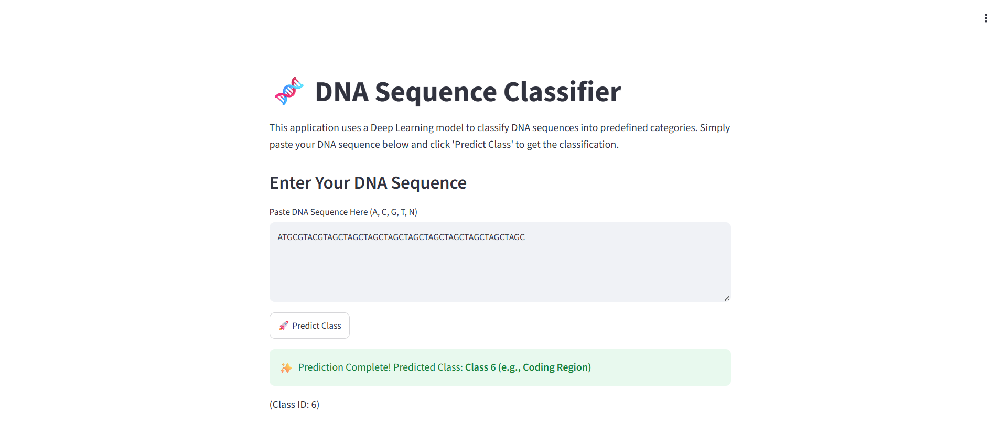
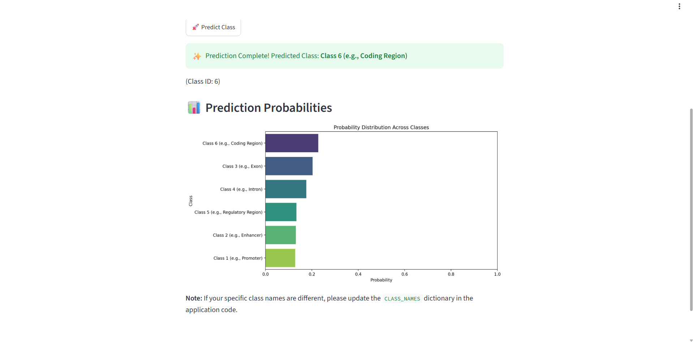

# 🧬 DNA Sequence Classification using Deep Learning

<p align="center">


</p>

<p align="center">

</p>

<p align="center">
<b>A Deep Learning-based DNA Sequence Classification System using TensorFlow & Keras for accurate genomic sequence prediction with an interactive Streamlit Web Application.</b>
</p>

---

# 📖 Overview

DNA sequence classification is one of the most important tasks in **Bioinformatics**, **Computational Biology**, and **Genomics**. It enables researchers to identify biological patterns, classify genetic sequences, and assist in disease diagnosis and genetic research.

This project develops an **end-to-end Deep Learning pipeline** that learns nucleotide sequence patterns using a **1D Convolutional Neural Network (CNN)**. The model performs automated DNA sequence classification after preprocessing, encoding, and feature extraction.

The project also includes a **Streamlit web application** that allows users to classify DNA sequences in real time.

---

# ✨ Features

- 🧬 DNA Sequence Classification
- 🧠 Deep Learning using 1D CNN
- 🔤 DNA Sequence Tokenization
- 📏 Sequence Padding
- 📊 Automatic Data Preprocessing
- 📈 Training & Validation Visualization
- 🎯 Real-time DNA Sequence Prediction
- 💾 Trained Model Saving
- 🌐 Interactive Streamlit Dashboard
- ⚡ Easy Deployment

---

# 🛠️ Tech Stack

| Category | Technology |
|----------|------------|
| Programming Language | Python |
| Deep Learning | TensorFlow, Keras |
| Machine Learning | Scikit-learn |
| Data Analysis | Pandas, NumPy |
| Visualization | Matplotlib |
| Deployment | Streamlit |
| Dataset Source | KaggleHub |
| Development Environment | Google Colab |

---

# 📂 Project Structure

```text
DNA-Sequence-Classification/
│
├── DNA_Sequence_Classification.ipynb
├── app.py
├── trained_model.keras
├── tokenizer.pkl
├── label_encoder.pkl
├── requirements.txt
├── README.md
│
├── images/
│   ├── dashboard.png
│   ├── architecture.png
│   ├── workflow.png
│   └── prediction.png
│
└── dataset/
```

---

# 📊 Dataset

The project utilizes a DNA sequence dataset containing nucleotide sequences along with their corresponding target classes.

### Dataset Pipeline

- Dataset Loading
- Data Cleaning
- Missing Value Handling
- Sequence Encoding
- Label Encoding
- Tokenization
- Sequence Padding
- Train-Test Split

---

# 🔄 Project Workflow

<p align="center">

</p>

```text
DNA Dataset
      │
      ▼
Data Preprocessing
      │
      ▼
Tokenization
      │
      ▼
Sequence Padding
      │
      ▼
Train-Test Split
      │
      ▼
Deep Learning Model
      │
      ▼
Model Training
      │
      ▼
Model Evaluation
      │
      ▼
Prediction
      │
      ▼
Streamlit Deployment
```

---

# 🧠 Model Architecture

<p align="center">

</p>

The proposed Deep Learning architecture consists of:

- Embedding Layer
- Conv1D Layer
- MaxPooling Layer
- Dropout Layer
- Additional Conv1D Layer
- Flatten Layer
- Dense Fully Connected Layer
- Softmax Output Layer

This architecture efficiently extracts meaningful features from DNA sequences while reducing overfitting through dropout regularization.

---

# 📈 Model Performance

The model is evaluated using several performance metrics.

### Evaluation Metrics

- ✅ Training Accuracy
- ✅ Validation Accuracy
- ✅ Training Loss
- ✅ Validation Loss
- ✅ Prediction Accuracy

Training history is visualized using accuracy and loss curves to evaluate convergence and detect overfitting.

---

# 📸 Prediction Dashboard

<p align="center">

</p>

The Streamlit application enables users to:

- Enter a DNA sequence
- Predict the sequence class
- View prediction results instantly
- Experience an intuitive and user-friendly interface

---

# 🚀 Installation

### Clone the Repository

```bash
git clone https://github.com/yourusername/DNA-Sequence-Classification.git
```

### Navigate to the Project Directory

```bash
cd DNA-Sequence-Classification
```

### Install Required Packages

```bash
pip install -r requirements.txt
```

### Run the Streamlit Application

```bash
streamlit run app.py
```

---

# 📦 Required Libraries

```text
tensorflow
keras
numpy
pandas
matplotlib
scikit-learn
streamlit
kagglehub
pickle
```

---

# 🎯 Applications

- Bioinformatics
- DNA Sequence Analysis
- Genomics
- Precision Medicine
- Genetic Disease Prediction
- Biomedical Research
- Molecular Biology
- Healthcare AI

---

# 🔮 Future Enhancements

- Transformer-based DNA Sequence Classification
- Attention Mechanisms
- Explainable AI (XAI)
- Hyperparameter Optimization
- Docker Deployment
- REST API Development
- Cloud Deployment (AWS/GCP/Azure)
- Multi-class Genomic Classification
- Performance Optimization for Large DNA Datasets

---

# 📚 Learning Outcomes

Through this project, the following concepts are implemented:

- Deep Learning Fundamentals
- Sequence Data Processing
- Natural Language-style Tokenization
- TensorFlow & Keras
- CNN for Sequential Data
- Model Evaluation
- Streamlit Deployment
- End-to-End AI Project Development

---

# 👨‍💻 Author

## **P. Aravind**

**AI & Data Science Student**

**Machine Learning | Deep Learning | Data Science | Bioinformatics | Artificial Intelligence**

📧 *Feel free to connect and contribute to this project.*

---

# 🤝 Contributing

Contributions, feature requests, and suggestions are welcome.

1. Fork the repository.
2. Create a feature branch.
3. Commit your changes.
4. Push to your branch.
5. Open a Pull Request.

---

# ⭐ Support

If you found this project helpful,

🌟 **Please consider giving it a Star on GitHub!**

Your support encourages future development and helps the project reach more learners and researchers.

---

# 🙏 Acknowledgements

- TensorFlow
- Keras
- Scikit-learn
- Streamlit
- KaggleHub
- Google Colab
- Open Source Bioinformatics Community

---

# 📄 License

This project is released under the **MIT License** and is intended for **educational, research, and learning purposes**.

You are free to use, modify, and distribute this project with proper attribution.

---

<p align="center">
Made with ❤️ by <b>P. Aravind</b>
</p>
